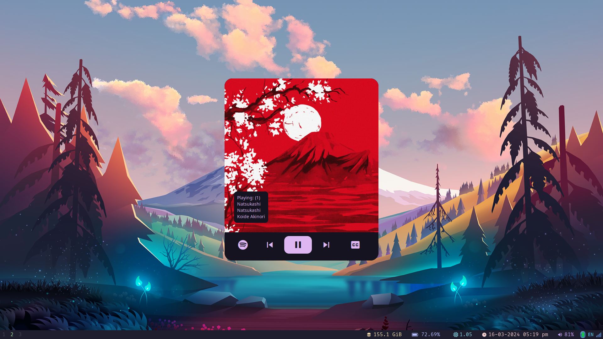

<bt />

# .dotfiles

This Dotfiles are tested with Debian and Fedora based distributions.
This configs are my daily work configs. feel free to fork it and change according to your needs.
Thanks :)

## Disclaimer

- I am using `zsh` shell as my default
- If you using install via script then be aware it'll auto install `Oh-My-Zsh` Plugin.
- At the time I wrote all this config is working. if In future any of the plugins or library may not work, Keep in mind.
- I wrote all the config with fellow ricers or developers, I forget where I pick up those scripts, Shout out to those hardworkers to keep community functioning.

## Table of Contents

- [Installation](#installation)
- [Configuration Includes](#configuration-includes)
- [Usage](#usage)
- [Credits](#credits)
- [Badges](#badges)
- [Features](#features)
- [How To Contribute](#how-to-contribute)
- [Tests](#tests)
- [Screenshots](#screenshots)

## Installation

1. Clone the repo in your home diretory of system by running below command in terminal

```bash
git clone --recurse-submodules -j8 https://github.com/hemilkaklotar/.dotfiles.git ~/.dotfiles
```

2. To install things run the install script by below command

```bash
~/.dotfiles/install
```

- it will ask few question what do you want to install and it will install accordingly
- it will link the configs to your home directory
- it will set git config which is inside the [git/.gitconfig](git/.gitconfig) make sure you change as per your username and email.

3. (Optional) Enable tap to click and three fingers touch to middle click

- Open this file with root permissions.

```bash
sudo nvim /etc/X11/xorg.conf.d/90-touchpad.conf
```

- Add below config to opened file.

```conf
Section "InputClass"
        Identifier "touchpad"
        MatchIsTouchpad "on"
        Driver "libinput"
        Option "Tapping" "on"
        Option "NaturalScrolling" "true"
        Option "TappingButtonMap" "lrm" # 2/2/3 finger, for 3-finger middle lrm
EndSection
```

4. (Optional) For Google chrome keyring issue for gnome follow below

```bash
sudo vim /usr/share/applications/google-chrome.desktop
```

- then add the below config after all `Exec` commands :)

```bash
--password-store=gnome-libsecret
```

- if you are using kde then use bellow for kde version 5 use `kwallet5` for version 6 use `kwallet6`

```bash
Exec=/usr/bin/google-chrome-stable --password-store=kwallet6 %U
```

- add qt6ct and lxappareance then add below to file

```bash
sudo echo "QT_QPA_PLATFORMTHEME=qt6ct" >> /etc/environment
```

5. (Optional) to setup redshift as system service in debian based distros.

Add this below systemd config to run on every login ─❯ `sudo nvim ~/.config/systemd/user/redshift.service`

```
[Unit]
Description=Redshift display colour temperature adjustment
Documentation=http://jonls.dk/redshift/
After=display-manager.service

[Service]
ExecStart=/usr/bin/redshift
Restart=always

[Install]
WantedBy=default.target
```

- Run `sudo systemctl --user enable redshift.service`
- Run `sudo systemctl --user start redshift.service`

## Configuration includes

- [x] i3wm
- [x] polybar
- [x] rofi
- [x] alacritty
- [x] dunst
- [x] lxappearance
- [x] qt6ct
- [x] zsh
- [x] tmux
- [x] kitty
- [x] catppuccin
- [x] sway wm
- [x] waybar

In future more module will be added!

## Usage

Follow the above instruction to clone and run scripts

- to more customization please fork this repo and then modify the your changes as per your distribution.

- I have created the config file and scripts for fedora and ubuntu with gnome and kde.

- Feel Free to create issues or pull request to update the dotfiles.

Thanks for your contribution!

## Credits

<!--  -->


- [Plater99](https://github.com/plater99)

Insipiration taken from fellow developers
you can check out their repo and create your own dotfiles if you needed.

- [ThePrimeagen/.dotfiles](https://github.com/ThePrimeagen/.dotfiles.git)

Rofi Themes are taken from the fellow developer adi1090x.
Check out his repo and create your own rofi theme.

- [adi1090x/rofi](https://github.com/adi1090x/rofi)

I appreciate their work which helps me alot. Thank you for your fabulous works..:)

## Badges


This repo includes the shell scripts and the configs for the component.

## Features

Dotfiles with i3wm, sway wm, polybar , rofi

- Theme : Catppuccin

## How to Contribute

[](CODE_OF_CONDUCT.md)

## Tests

All the configs files are here are tested.
If any problem occured while installing keep issue open. or contribute to solve those issue.

## Screenshots

<pre>
  <br />
 
</pre>

