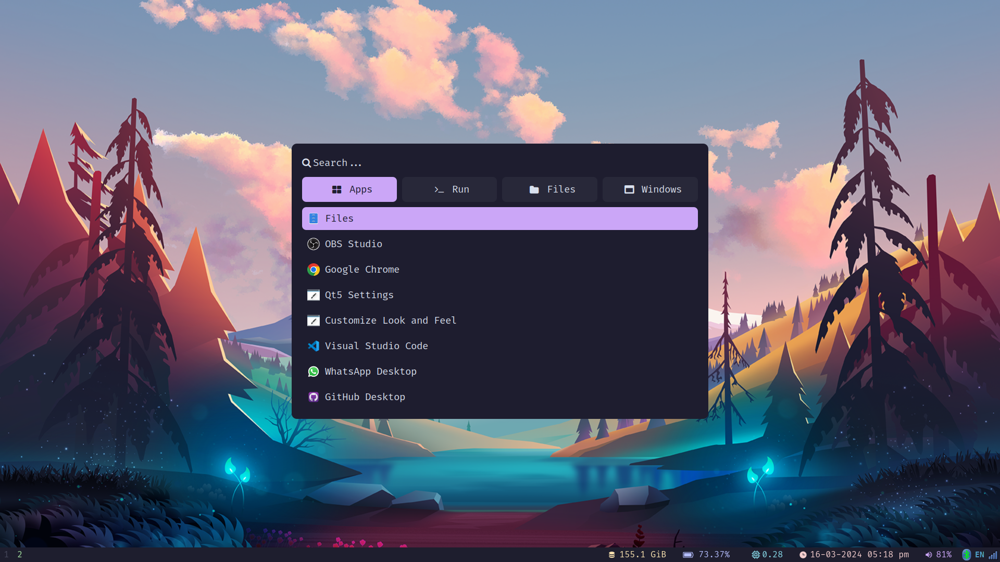

# .dotfiles

Recently swithed to Fedora with gnome and i3wm,
Before that I was using Ubuntu with gnome and i3wm

I am using `zsh` shell as my default

<pre>
  <br />
 
</pre>

## Table of Contents

- [Installation](#installation)
- [Configuration Includes](#configuration-includes)
- [Usage](#usage)
- [Credits](#credits)
- [License](#license)

## Installation

1. Clone the repo in your home diretory of system by running below command in terminal

```bash
git clone https://github.com/hemilkaklotar/.dotfiles.git ~/
```

1.5 To install things run the install script by below command

```bash
source ~/.dotfiles/install.sh
```

2. run link.sh file in terminal by running bellow command

```bash
bash ./link.sh
```

OR

```zsh
. ./link.sh
```

3. Install dependancy and required packages

- comment the lines or block of code that you don't want in your system in `./dependency.sh`

- run below command to install the dependancy

```zsh
sudo bash ./dependancy.sh
```

4. Enable tap to click and three fingers touch to middle click

```conf
# /etc/X11/xorg.conf.d/90-touchpad.conf
Section "InputClass"
        Identifier "touchpad"
        MatchIsTouchpad "on"
        Driver "libinput"
        Option "Tapping" "on"
        Option "NaturalScrolling" "true"
        Option "TappingButtonMap" "lrm" # 2/2/3 finger, for 3-finger middle lrm
EndSection
```

- For Google chrome keyring issue for gnome follow below

```
sudo vim /usr/share/applications/google-chrome.desktop
```

then add the `--password-store=gnome-libsecret` after all `Exec` commands :)

- add qt5ct and lxappareance then add below to file

`sudo echo "QT_QPA_PLATFORMTHEME=qt5ct" >> /etc/environment`

## Configuration includes

- [x] i3wm
- [x] polybar
- [x] rofi
- [x] alacritty
- [x] dunst
- [x] lxappearance
- [x] qt5ct
- [x] zsh

In future more module will be added!

## Usage

Follow the above instruction to clone and run scripts

- to more customization please fork this repo and then modify the your changes as per your distribution.

- I have created the config file and scripts for fedora and ubuntu with gnome and kde.

- Feel Free to create issues or pull request to update the dotfiles.

Thanks for your contribution!

## Credits

<!--  -->


- [Plater99](https://github.com/plater99)

Insipiration taken from fellow developers
you can check out their repo and create your own dotfiles if you needed.

- [ThePrimeagen/.dotfiles](https://github.com/ThePrimeagen/.dotfiles.git)

Rofi Themes are taken from the fellow developer adi1090x.
Check out his repo and create your own rofi theme.

- [adi1090x/rofi](https://github.com/adi1090x/rofi)

I appreciate their work which helps me alot. Thank you for your fabulous works..:)

## Badges


This repo includes the shell scripts and the configs for the component.

## Features

Dotfiles with i3wm and polybar , rofi

- Theme : Gruvbox

## How to Contribute

[](CODE_OF_CONDUCT.md)

## Tests

All the configs files are here are tested
